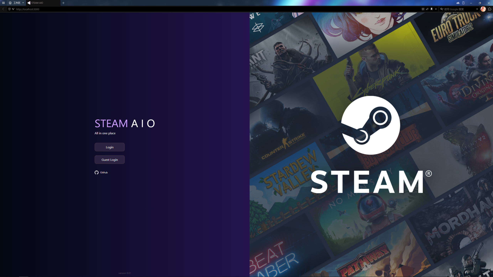
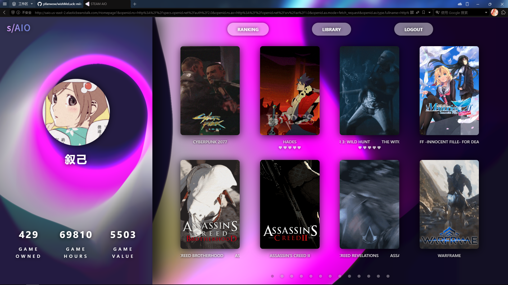

### Open Link for Project
[S/AIO](http://saio.us-east-2.elasticbeanstalk.com)

### [DevelopPlan](developPlan.md) for two weeks.
  
## Introduction
This project is a dynamic web application aimed at enhancing the gaming experience for Steam users by providing a personalized dashboard. Users can log into the application with their Steam accounts and access extensive information about their gaming libraries. The application showcases user profiles, organizes games into various genres like shooting, adventure, simulation, and casual, and offers detailed statistics on game usage including total playtime and storage requirements.  
  
Key features also include the ability for users to rate games, track changes in their gaming habits over time, and customize the display of their game libraries through different sorting options. The application is designed with a clear separation between front-end and back-end; the front-end is built using Node.js and React, ensuring a responsive and intuitive user interface, while the back-end employs Express and utilizes Passport for handling authentication via the Steam API.  
  
Data management is facilitated through MongoDB, which stores user game data, allowing direct interaction between the front-end user actions and the database. The application is deployed using AWS Elastic Beanstalk to ensure robust scalability and performance.  
  
Looking ahead, there are plans to expand the application by integrating with C# and the .NET framework to create a local application. This future enhancement would enable direct reading and writing to Steam directory files, allowing users to synchronize information from the database with their local Steam library, further bridging the gap between web and local gaming environments.  
    
   

## ScreenShot

      
## How to test
run install npm  
run npm install @mui/material @mui/icons-material swiper    
run npm start  
run node app.js  